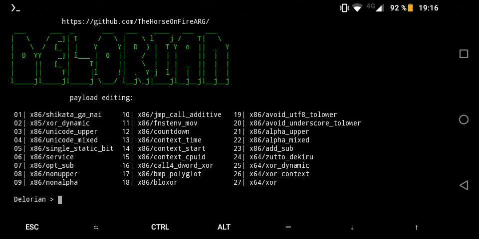

# Delorian
<h6>Descripcion</h6>
 

Delorian 1.0, generates MSF payloads, server where to host our fake sites to violate the users of the company where we are legally working, any purpose of profit, violate the privacy of people outside our work as pentesters or commit computer crimes we do not We hold them responsible since Delorian 1.0 is created for the sole purpose of raising awareness or simply to use it in pentesting sessions within the legal framework. Delorian generates Metasploit-Framework payloads, generates a simple Python server at port 8000 on our localhost with a fake site to violate our victim with social engineering or DNS Spoofing, fake sites are according to windows (update firewall) and Android (download update app) the indexes or fake sites can be edited, the script banner shows where our Trojan will be, our website and the traffic of what is happening on our simple server. To make it difficult for cybercriminals we created delorian within our LAN network, so that phishing, fake sites are not used for malicious purposes, and soon you will see a video of the updated tool, since a video was previously recorded on our channel of Youtube to show a preview, the tool was saved and was not finished, the indexes are badly created in order not to violate anyone or lie to anyone to take access to their android or windows, but they can be edited to have better results, same with Trojans.

<h5>It is recommended to test first to avoid being disoriented, video tutorial on our YouTube channel.</h5>

<h6>Muestra:</h6>

<h6>installation:</h6>

git clone https://github.com/error404-notfound/Delorian

cd Delorian

chmod +x *

./install.sh
 

./Delorian

<h6>information:</h6>

The windows index will be saved in the path: $PREFIX/usr/delorian/windows/sitio

The android index will be saved in the path: $PREFIX/usr/delorian/android/sitio/

 

The indexes are 100% modifiable, the ones that are pre-edited are only for samples, and if we wanted something more serious, we would have to edit them according to the social engineering that we are going to do at the moment.

Virus Windows $PREFIX/usr/delorian/windows/upfirewall.exe

Virus Android $PREFIX/usr/delorian/android/android.apk

 

You must modify the indexes in botton.

